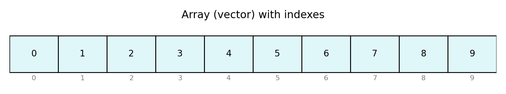

# Módulo 1 – Fundamentos de estructuras de datos y análisis de algoritmos

## Objetivos del módulo

Al finalizar este módulo el estudiante será capaz de:

- Definir qué es un algoritmo y describir sus propiedades esenciales.  
- Analizar la eficiencia de un algoritmo en tiempo y memoria utilizando notación Big O.  
- Reconocer diferentes paradigmas algorítmicos (divide y vencerás, voraces, programación dinámica).  
- Explicar qué es un tipo de dato abstracto (TDA) y por qué es independiente de su implementación.  
- Comprender el funcionamiento de vectores y matrices como estructuras de datos estáticas.  

---

## 1. Introducción

Los **algoritmos** son secuencias finitas de pasos que resuelven un problema definido.  

Las instrucciones deben ser lo suficientemente precisas para que un ordenador pueda ejecutarlas sin ambigüedad.  

Su importancia no radica solo en dar una respuesta correcta, sino en hacerlo de manera **eficiente**, aprovechando el tiempo de cómputo y la memoria disponibles.  

Las **estructuras de datos** proporcionan formas de organizar la información para que los algoritmos accedan a ella de manera más eficaz. En este módulo se introducen los conceptos básicos: **tipos de dato abstracto (TDA)**, la **notación Big O**, los principales **paradigmas algorítmicos** y los **vectores**(o arrays) como ejemplo de estructura estática.  

---

## 2. Concepto y representación de algoritmos

Un **algoritmo** debe cumplir ciertas propiedades:

- **Finitud**: siempre termina.  
- **Definición precisa**: cada paso está claramente especificado, sin ambigüedad.  
- **Entrada y salida**: recibe datos de entrada y produce resultados.  

Para representarlos se utilizan **pseudocódigo** y **diagramas de flujo**, que permiten describirlos de manera formal.  

**Ejemplo simple**: encontrar el mayor de dos números.  

```text
Algoritmo MayorDeDos(a, b):
  si a ≥ b entonces
    devolver a
  si no
    devolver b
```

---

## 3. Análisis de eficiencia y notación Big O

La eficiencia de un algoritmo se mide en dos dimensiones principales:

* **Tiempo de ejecución**: número de operaciones realizadas en función del tamaño de la entrada (*n*).
* **Uso de memoria**: cantidad de espacio adicional necesario para ejecutarlo.

### 3.1 Crecimiento con el tamaño de la entrada

El comportamiento varía según el tamaño de *n*:

* Algoritmos **O(n)** escalan linealmente.
* Algoritmos **O(n²)** crecen de forma cuadrática, lo que los hace inviables en contextos como la bioinformática.

### 3.2 Peor caso, mejor caso y caso promedio

* **Peor caso**: Ofrece un límite superior del tiempo de ejecución para cualquier entrada válida. Es útil para garantizar que el algoritmo siempre será lo suficientemente rápido. Garantiza rendimiento incluso con datos adversos.
* **Mejor caso**: Proporciona un límite inferior y refleja la situación más favorable (por ejemplo, datos ya ordenados). A menudo no es representativo de casos reales.
* **Caso promedio**: Calcula el tiempo de ejecución esperado teniendo en cuenta todas las posibles entradas y sus probabilidades. Es importante cuando se conocen las distribuciones de datos.

### 3.3 Paradigmas algorítmicos

* **Divide y vencerás**: dividir el problema en subproblemas (ej. *merge sort*).
* **Voraces**: toman decisiones locales óptimas (ej. algoritmos de grafos).
* **Programación dinámica**: reutilizan soluciones parciales (ej. Needleman–Wunsch en alineamiento de secuencias).

### 3.4 Tabla de complejidad habitual

| Orden          | Descripción        | Ejemplo                            |
| -------------- | ------------------ | ---------------------------------- |
| **O(1)**       | Tiempo constante: el número de operaciones no depende del tamaño de la entrada   | Acceder a un elemento de un vector |
| **O(log n)**   | Tiempo logarítmico: el algoritmo reduce el tamaño del problema a la mitad en cada paso | Búsqueda binaria                   |
| **O(n)**       | Tiempo lineal: se realiza un número de operaciones proporcional al tamaño de la entrada      | Recorrer una lista                 |
| **O(n log n)** | Cuasilineal: Proporcional a n*log(n). En la práctica se comporta casi como uno lineal porque el crecimiento logaritmico es despreciable      | *Quicksort*, *Merge sort*          |
| **O(n²)**      | Cuadrático:  el número de operaciones es proporcional al cuadrado del tamaño de la entrada         | *Bubble sort*                      |

⚡ Además de Big O, existen notaciones **Ω** (cota inferior) y **Θ** (cota ajustada), que completan el análisis teórico.

---

## 4. Ejemplos aplicados en bioinformática

* **Cálculo del contenido GC en una secuencia**: algoritmo **O(n)**.

```python
seq = "ATGCGCTAAGC"
gc = sum(1 for base in seq if base in "GC") / len(seq)
print(f"GC%: {gc:.2%}")
```

* **Comparación de todas las parejas de secuencias en un genoma**: complejidad **O(n²)** → impracticable en genomas completos.
* **Alineamiento global**: programación dinámica (**O(n·m)** para dos secuencias de longitudes *n* y *m*).

---

## 5. Tipos de estructuras de datos

Las estructuras de datos organizan la información según necesidades:


| Tipo          | Descripción        | Ejemplo                            |
| -------------- | ------------------ | ---------------------------------- |
| **Lineales**   | almacenan elementos de manera secuencial; cada elemento (excepto el primero y el último) tiene un predecesor y un sucesor | vectores, listas, pilas, colas. |
| **Jerárquicas**   |  Organizan los elementos en niveles de jerarquía. | árboles, heaps |
| **Redes**   |   | Estructura de datos no lineal que sirve para modelar relaciones entre objetos | grafos |
| **Estáticas**   |   su tamaño se define en el momento de la creación y no puede variar | tamaño fijo (arrays) |
| **Dinámicas**   |  pueden crecer o decrecer durante la ejecución. Estas estructuras aprovechan asignación dinámica de memoria para ajustar su tamaño a las necesidades del programa. | listas enlazadas, árboles y grafos. 


### 5.1 Tipo de dato abstracto (TDA)

Un **TDA** se define por **operaciones y reglas** que cumple, no por su implementación.
Ejemplo: una pila, que siempre ofrece `apilar`, `desapilar`, `consultar`. Puede implementarse con vectores o listas enlazadas.

---

## 6. Vectores y matrices

Los **vectores** son arrays unidimensionales de tamaño fijo:

* **Acceso**: O(1) gracias a direcciones contiguas.
* **Recorrido**: O(n).
* **Inserción/eliminación**: O(n), porque hay que desplazar elementos.

Las **matrices** son arrays bidimensionales. Un array $m \times n$ puede verse como un vector de $m$ filas con $n$ columnas.

{ width=80% }

*Figura 1: representación de un vector de diez elementos con sus índices.*

---

## 7. Conclusiones

En este módulo hemos:

* Definido qué es un algoritmo y cómo medir su eficiencia.
* Estudiado la notación Big O y otras notaciones complementarias.
* Reconocido paradigmas algorítmicos clave.
* Revisado la clasificación de estructuras de datos y profundizado en vectores y matrices.

📌 Comprender estos fundamentos no es un ejercicio académico: es lo que marca la diferencia entre esperar días para un análisis genómico o tener resultados en minutos.

---

## 8. Ejercicios de autoevaluación

1. ¿Cuál es la complejidad temporal de recorrer una matriz $m \times n$?
2. ¿Por qué la programación dinámica es útil en alineamiento de secuencias?
3. Explica la diferencia entre un TDA y su implementación.
4. Si un algoritmo tarda 2 segundos con *n=1000* y es **O(n²)**, ¿cuánto tardará aproximadamente con *n=2000*?

---

## Referencias

1. Descripción de la búsqueda binaria y su complejidad $O(\log n)$.
2. Clasificación de las estructuras de datos: vectores, listas, pilas, colas, árboles, heaps y grafos.
3. Definición de tipo de dato abstracto (TDA) como modelo matemático definido por operaciones y comportamiento.
4. Propiedades de los arrays estáticos: memoria contigua, acceso por índice y tamaño fijo.
5. Complejidad de algoritmos de ordenación: *quicksort* $O(n \log n)$, *merge sort* $O(n \log n)$, *bubble sort* $O(n^2)$.

```