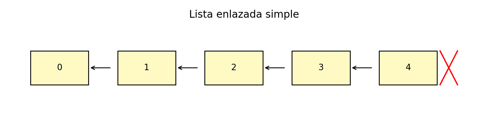
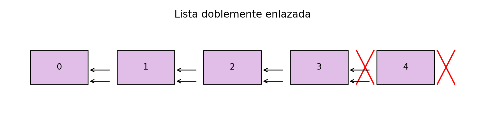
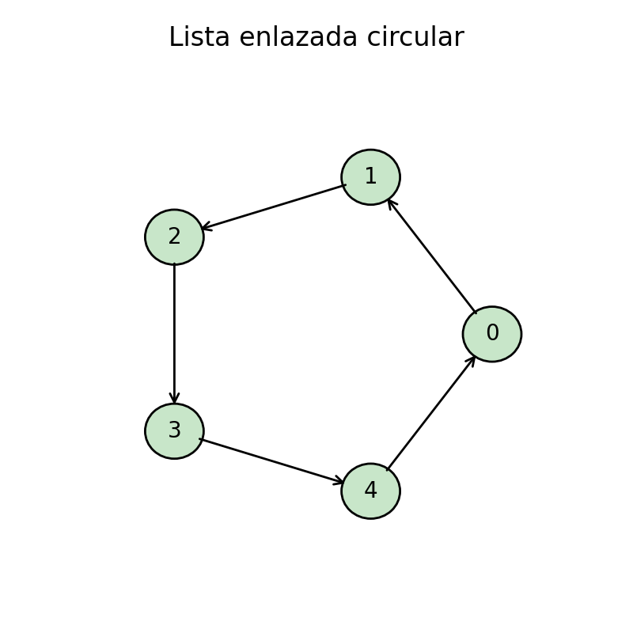

# Módulo 2 – Listas enlazadas

---

## Introducción

En el módulo anterior vimos que los **vectores (arrays)** son estructuras de datos muy útiles cuando queremos **acceder rápidamente a un elemento cualquiera** mediante su índice. Esta eficiencia, sin embargo, viene con un precio: su tamaño es **fijo**.
Si declaramos un vector de tamaño 10, ni podemos ampliarlo mágicamente a 100, ni reducirlo a 5 sin crear otro en memoria.

📌 **Problema motivador**: imagina que gestionas un programa de edición genética en el que las bases de ADN se van insertando o eliminando de forma dinámica. Con arrays, cada modificación implica desplazar miles de posiciones en memoria. Con listas enlazadas, basta con ajustar un par de punteros.

Para superar las limitaciones de los vectores aparecen las **listas enlazadas**.
Una lista enlazada es una estructura dinámica en la que cada elemento (o **nodo**) contiene:

* La información (dato).
* Una referencia (puntero o enlace) hacia el siguiente nodo.

De esta manera, el tamaño de la lista se **adapta en tiempo de ejecución**: podemos añadir y quitar nodos sin necesidad de reservar o liberar grandes bloques contiguos de memoria.

---

## 1. Estructura de una lista enlazada simple

Una **lista enlazada simple** está formada por nodos conectados uno tras otro. Cada nodo tiene dos campos:

1. **Dato**: la información que queremos almacenar (números, cadenas, estructuras).
2. **Enlace**: un puntero que indica la dirección del siguiente nodo.

El primer nodo se denomina **cabeza** (*head*), y el último nodo apunta a `null`, señalando el final de la lista.

{ width=80% }

*Figura 2: lista enlazada simple de cinco nodos.*

### 1.1 Operaciones básicas y coste

* **Inserción al inicio** → $O(1)$
  Basta con redirigir el puntero de la cabeza.
* **Inserción al final** → $O(n)$
  Necesitamos recorrer toda la lista hasta el último nodo.
* **Inserción intermedia** → $O(n)$
  Hay que llegar a la posición deseada.
* **Eliminación** → $O(1)$ si es la cabeza; $O(n)$ si está en medio (hay que conocer el nodo anterior).
* **Búsqueda** → $O(n)$, porque no existe acceso aleatorio.

#### Pseudocódigo de inserción al inicio

```text
NODO insertarInicio(LISTA L, DATO x):
    nuevo ← crearNodo(x)
    nuevo.siguiente ← L.cabeza
    L.cabeza ← nuevo
```

#### Pseudocódigo de búsqueda

```text
NODO buscar(LISTA L, DATO x):
    actual ← L.cabeza
    mientras actual ≠ null hacer
        si actual.dato = x entonces
            devolver actual
        actual ← actual.siguiente
    devolver null
```

📌 Nota filosófica: la lista enlazada simple nos recuerda que **a veces el camino importa más que la meta**. Para llegar al nodo 5, no podemos saltar, debemos recorrer la lista paso a paso, como quien lee una novela página a página.

---

## 2. Listas doblemente enlazadas

Una mejora importante es la **lista doblemente enlazada**.
Aquí cada nodo guarda tres campos:

* El **dato**.
* Un **puntero al siguiente**.
* Un **puntero al anterior**.

Esto permite recorrer la lista en **ambos sentidos** y facilita operaciones como eliminar un nodo sin necesidad de conocer a su predecesor.

{ width=80% }

*Figura 3: lista doblemente enlazada.*

⚡ Inconveniente: se necesita más memoria por nodo y más trabajo al insertar (hay que actualizar dos punteros en vez de uno).

📜 **Anécdota histórica**: las primeras implementaciones de editores de texto en los años 70 (como *EMACS*) usaban listas doblemente enlazadas para representar líneas de texto, porque resultaba natural moverse hacia adelante y atrás en el documento.

---

## 3. Listas circulares

En una **lista circular**, el último nodo no apunta a `null` sino de nuevo al primero. De esta forma, el recorrido nunca se detiene: no existe un “final”.

Características:

* La **cabeza** puede ser cualquier nodo.
* Mantener un puntero al último nodo permite insertar al inicio y al final en tiempo constante.

{ width=65% }

*Figura 4: lista enlazada circular.*

### Aplicaciones típicas

* **Planificadores de CPU** (algoritmo round-robin).
* **Listas de reproducción de música** que vuelven al inicio.
* **Juegos de mesa** donde los turnos son cíclicos.

También existen **listas doblemente circulares**, que permiten navegar hacia adelante y atrás sin límites.

---

## 4. Comparación con arrays

| Característica              | Lista enlazada                                               | Vector (array)                          |
| --------------------------- | ------------------------------------------------------------ | --------------------------------------- |
| **Crecimiento**             | Dinámico, tamaño ajustable en tiempo de ejecución.           | Estático, tamaño fijo.                  |
| **Acceso aleatorio**        | No, recorrido secuencial $O(n)$.                           | Sí, acceso $O(1)$ mediante índices.   |
| **Inserción/eliminación**   | $O(1)$ si se conoce el nodo; $O(n)$ si hay que recorrer. | $O(n)$ (desplazamiento de elementos). |
| **Uso de memoria**          | Requiere punteros adicionales.                               | Más compacta y contigua.                |
| **Localidad de referencia** | Baja: nodos dispersos en memoria.                            | Alta: aprovecha mejor la caché.         |

**Conclusión práctica**:

* Usa **listas enlazadas** si habrá muchas inserciones y eliminaciones.
* Usa **arrays** si necesitas acceso rápido por índice y mejor rendimiento en caché.

📌 Filosofía: la elección de la estructura de datos depende del **patrón de uso**, no de una “mejor” universal.

---

## 5. Casos de uso en bioinformática y computación

* **Gestión dinámica de secuencias**: en ediciones de ADN, cuando se insertan o eliminan bases constantemente.
* **Colas de procesos**: en sistemas operativos, donde los procesos entran y salen de forma continua.
* **Modelado molecular dinámico**: los átomos o enlaces pueden crearse o desaparecer según la simulación.
* **Editores de texto**: representan cada línea como un nodo enlazado.
* **Sistemas de música/juegos**: listas circulares para reproducción o turnos cíclicos.

📜 **Curiosidad**: Unix implementaba en algunos shells listas circulares para gestionar el historial de comandos, haciendo que se “reciclaran” automáticamente.

---

## 6. Conclusiones

Las listas enlazadas **resuelven las limitaciones de tamaño fijo** de los arrays.

* Son flexibles: crecen y decrecen dinámicamente.
* Permiten inserciones y eliminaciones sin desplazar elementos.
* Existen variantes (doble, circular) que se adaptan a diferentes necesidades.

👉 Filosóficamente, podríamos decir que los arrays representan la **estabilidad** (todo en su sitio, contiguo, fijo), mientras que las listas enlazadas representan la **adaptación** (cambian sobre la marcha, sacrificando eficiencia en el acceso).

---

## 7. Ejercicios de autoevaluación

1. ¿Cuál es el coste temporal de acceder al elemento $i$ en una lista enlazada simple?
2. Explica por qué una lista doblemente enlazada facilita la eliminación de un nodo conocido.
3. Implementa en pseudocódigo la inserción al final de una lista enlazada simple. ¿Cuál es su complejidad?
4. Diseña un ejemplo donde una lista circular sea más eficiente que un array.
5. ¿Por qué las listas enlazadas tienen peor aprovechamiento de la caché que los arrays?
6. Analiza qué estructura usarías para un sistema que procesa continuamente colas de trabajos.
7. (Avanzado) ¿Podrías implementar una lista enlazada en un lenguaje sin punteros explícitos (ej. Python)? ¿Cómo?

---

## Referencias

* Cormen, T. H., Leiserson, C. E., Rivest, R. L., & Stein, C. *Introduction to Algorithms*. MIT Press.
* Goodrich, M. T., Tamassia, R., & Goldwasser, M. H. *Data Structures and Algorithms in Python*. Wiley.
* Weiss, M. A. *Data Structures and Algorithm Analysis*. Pearson.
* Sedgewick, R. & Wayne, K. *Algorithms*. Addison-Wesley.
* Knuth, D. *The Art of Computer Programming, Vol. 1: Fundamental Algorithms*. Addison-Wesley.
