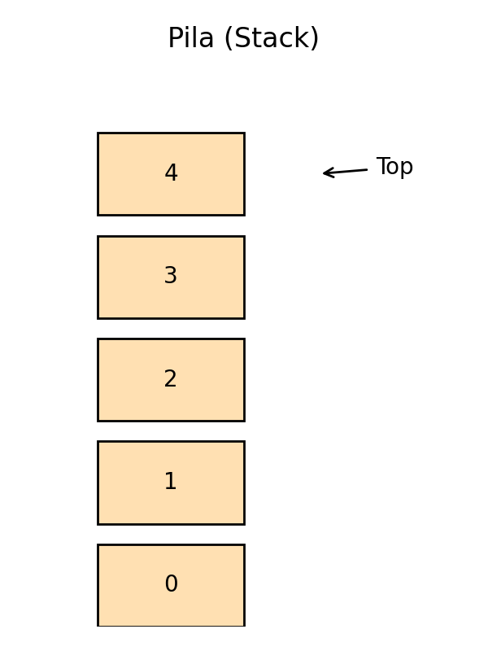
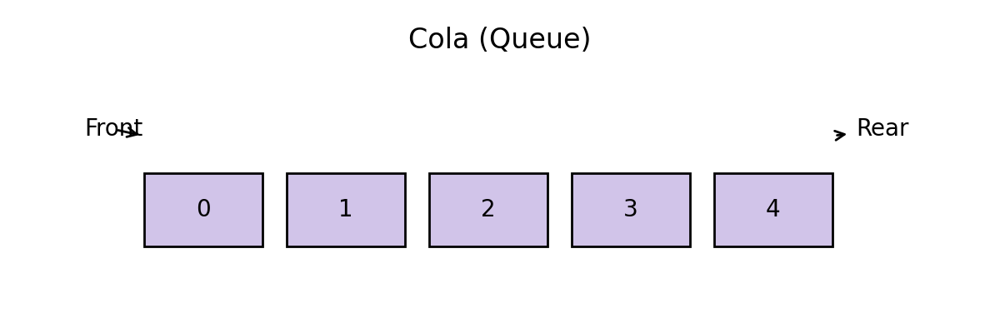

# Módulo 3 – Pilas y Colas: Gestionando el Orden en la Complejidad

## 0. Motivación: El Poder de las Restricciones

Antes de sumergirnos en la implementación, es crucial preguntarse: ¿por qué querríamos limitar nuestro acceso a los datos? En un mundo donde las listas y los arrays nos dan la libertad de acceder a cualquier elemento por su índice (`array[i]`), las pilas y colas parecen un paso atrás.

La respuesta reside en una poderosa filosofía de diseño de software: **la restricción como herramienta para la simplicidad y la seguridad**.

1.  **Reducción de la Complejidad Cognitiva**: Al limitar las operaciones a `push/pop` o `enqueue/dequeue`, el programador no tiene que pensar en todos los posibles estados de la estructura. El comportamiento es predecible y fácil de razonar. Esto es como las marchas de un coche: en lugar de controlar la rotación del motor directamente, usamos una abstracción (primera, segunda, etc.) que simplifica la conducción.
2.  **Prevención de Errores**: Imponer un orden de acceso estricto (LIFO o FIFO) evita errores comunes, como modificar un elemento en medio de una colección mientras se está procesando o acceder a datos en el orden incorrecto en un sistema concurrente.
3.  **Modelado del Mundo Real**: Muchas procesos del mundo real son inherentemente LIFO o FIFO. Las pilas y colas no son invenciones abstractas, sino **modelos matemáticos de procesos reales**:
      * La pila de llamadas de un programa refleja cómo las tareas se anidan y resuelven.
      * Una cola de impresión refleja el principio de justicia de "el primero que llega, es el primero en ser servido".

Al adoptar estas restricciones, ganamos claridad, robustez y algoritmos que son un reflejo fiel de los problemas que intentan solucionar.

-----

## 1. Pilas (Stacks): La Memoria del Presente Reciente

Una **pila** es una estructura de datos que opera bajo el principio **LIFO (Last-In, First-Out)**. Su analogía más famosa es una pila de platos: solo puedes interactuar con el plato que está en la cima. Esta estructura es fundamental para gestionar procesos que tienen una naturaleza jerárquica o recursiva, donde la tarea más reciente debe ser la primera en resolverse.

### 1.1 Operaciones Principales y Casos Límite

Las operaciones definen la "personalidad" de la pila. Es crucial entender no solo lo que hacen, sino también sus condiciones de error.

  * **`apilar` (push)**: Añade un elemento a la cima de la pila.
      * **Caso Límite**: Si la pila está implementada con un array de tamaño fijo y ya está llena, se produce un error de **desbordamiento de pila (Stack Overflow)**. Este es uno de los errores más famosos de la programación.
  * **`desapilar` (pop)**: Elimina el elemento de la cima y lo devuelve.
      * **Caso Límite**: Si se intenta desapilar un elemento de una pila vacía, se produce un error de **subdesbordamiento (Stack Underflow)**. El programa debe gestionar esta situación para evitar un comportamiento indefinido.
  * **`consultar` (peek/top)**: Devuelve el elemento de la cima sin modificar la pila. Es una operación de solo lectura.
  * **`vacía` (isEmpty)**: Booleano que indica si la pila no contiene elementos.
  * **`tamaño` (size)**: Devuelve el número de elementos actualmente en la pila.

#### Pseudocódigo básico

```text
procedimiento apilar(PILA P, DATO x):
    P.tope ← P.tope + 1
    P.elementos[P.tope] ← x

DATO desapilar(PILA P):
    si P.tope = 0 entonces error "Pila vacía"
    x ← P.elementos[P.tope]
    P.tope ← P.tope - 1
    devolver x
```

### 1.2. Análisis Detallado de Implementaciones

La elección de la implementación subyacente (array o lista enlazada) tiene implicaciones en el rendimiento y el uso de memoria.

| Característica          | Implementación con Vector (Array)                              | Implementación con Lista Enlazada                                 |
| ----------------------- | -------------------------------------------------------------- | ----------------------------------------------------------------- |
| **Rendimiento**         | $O(1)$ amortizado. Las operaciones son muy rápidas.          | $O(1)$ garantizado. Siempre es una operación constante.         |
| **Uso de Memoria**      | Puede desperdiciar memoria si se reserva más de la necesaria.  | Más eficiente: solo usa la memoria que necesita.                  |
| **Overhead de Memoria** | Mínimo (solo el array y un índice `tope`).                     | Mayor: cada elemento necesita un puntero adicional (`siguiente`). |
| **Localidad de Caché**  | **Excelente**. Los elementos están contiguos en memoria.       | **Pobre**. Los nodos pueden estar dispersos por la memoria.       |
| **Flexibilidad**        | Tamaño fijo (a menos que se use un array dinámico, con coste). | Dinámica y flexible por naturaleza.                               |

**Conclusión Filosófica**: La implementación con **vector** es preferible cuando el tamaño máximo es conocido o predecible y el rendimiento es crítico (gracias a la caché). La **lista enlazada** es ideal para situaciones donde el tamaño es impredecible y la flexibilidad es la máxima prioridad.

### 1.3. Caso de Estudio a Fondo: La Pila de Llamadas (Call Stack)

Quizás la aplicación más importante de las pilas es la **gestión de la pila de llamadas a funciones** en casi todos los lenguajes de programación modernos. Sin ella, la recursión y la propia estructura de nuestros programas serían imposibles.

**¿Cómo funciona?**

1. **Programa Principal**: El sistema operativo crea un "marco de pila" (stack frame) para la función `main()`. Este marco contiene sus variables locales y la dirección de retorno.
2. **Llamada a Función**: Cuando `main()` llama a `funcionA()`, se crea un nuevo marco para `funcionA` y se apila **encima** del de `main()`.
3. **Llamadas Anidadas**: Si `funcionA()` llama a `funcionB()`, se apila un nuevo marco para `funcionB` en la cima.
4. **Retorno**: Cuando `funcionB()` termina, su marco se **desapila**. El control vuelve a `funcionA()`, que ahora está de nuevo en la cima.
5. **Fin**: El proceso continúa hasta que todas las funciones han retornado y la pila vuelve a estar vacía (solo con `main`, que al terminar devuelve el control al SO).

**Diagrama conceptual:**

```
      Pila:
    | Marco funcionB | <-- Cima (en ejecución)
    |----------------|
    | Marco funcionA |
    |----------------|
    | Marco main()   |
    +----------------+
```

Este mecanismo es la razón por la que una recursión infinita causa un error de **Stack Overflow**: cada llamada recursiva apila un nuevo marco hasta que se agota la memoria asignada a la pila.

{ width=50% }

*Figura 5: estructura LIFO.*

📌 *Filosofía*: la pila nos enseña que **la historia reciente es la más importante**: lo último que hicimos es lo primero que podemos deshacer.

---

## 2. Colas (Queues): La Justicia del Orden de Llegada

Una **cola** implementa el principio **FIFO (First-In, First-Out)**. Es el modelo de la fila de un supermercado: la primera persona en llegar es la primera en ser atendida. Este principio de justicia y orden secuencial es clave para sistemas que gestionan recursos compartidos o procesan tareas en el orden en que fueron solicitadas.

### 2.1 Operaciones Principales

* **`encolar` (enqueue)**: Añade un elemento al **final** de la cola.
* **`desencolar` (dequeue)**: Elimina el elemento del **principio** de la cola y lo devuelve.
* **`frente` (front/peek)**: Consulta el primer elemento sin retirarlo.
* **`vacía` (isEmpty)**: Indica si la cola está vacía.

#### Pseudocódigo básico

```text
procedimiento encolar(COLA Q, DATO x):
    Q.trasero ← Q.trasero + 1
    Q.elementos[Q.trasero] ← x

DATO desencolar(COLA Q):
    si Q.frente > Q.trasero entonces error "Cola vacía"
    x ← Q.elementos[Q.frente]
    Q.frente ← Q.frente + 1
    devolver x
```

### 2.2 Implementaciones y el Desafío de la Cola Circular

**El Problema de la Implementación con Vector Simple:**

Si usamos un vector con dos punteros, `frente` y `trasero`, nos encontramos con un problema. A medida que encolamos y desencolamos, ambos punteros avanzan. Eventualmente, `trasero` llegará al final del array, y no podremos añadir más elementos, **incluso si hay espacio libre al principio** (dejado por los elementos desencolados).

**La Solución Elegante: La Cola Circular**

La cola circular resuelve esto tratando el array como si fuera un círculo. Cuando un puntero llega al final, simplemente "da la vuelta" y continúa desde el principio.

Esto se logra con la **aritmética modular**. Para un array de tamaño $N$:

* Para avanzar el puntero `trasero`: `trasero = (trasero + 1) % N`
* Para avanzar el puntero `frente`: `frente = (frente + 1) % N`

Este diseño es increíblemente eficiente y es el estándar para implementar buffers de tamaño fijo en sistemas operativos, redes y hardware.

### 2.3 Variantes de Colas

* **Cola Circular**: Como se vio, es una optimización para implementaciones con arrays. Es la base de los *ring buffers*.
* **Deque (Cola Doble)**: Del inglés *Double-Ended Queue*. Es una estructura híbrida que permite **encolar y desencolar por ambos extremos**. Es una navaja suiza de las estructuras lineales, útil en algoritmos de ventanas deslizantes (*sliding window*) o para construir otros algoritmos más complejos.
* **Cola de Prioridad**: Rompe la regla FIFO. Cada elemento tiene una **prioridad** asociada. Al desencolar, siempre se extrae el elemento con la máxima prioridad, sin importar cuándo llegó. No se implementa con arrays o listas, sino con estructuras más complejas como los **heaps (montículos)**. Son esenciales en algoritmos como el de Dijkstra (para encontrar el camino más corto en un grafo) o en la planificación de procesos de un SO donde algunas tareas son más urgentes que otras.

### 2.4 Caso de Estudio a Fondo: El Planificador de Procesos del Sistema Operativo

Los sistemas operativos modernos son multitarea, lo que significa que pueden ejecutar múltiples procesos (casi) simultáneamente. ¿Cómo decide la CPU a qué proceso prestarle atención en cada momento? La respuesta más simple es una **cola de procesos listos (Ready Queue)**.

1. **Llegada de Procesos**: Cuando un programa se lanza (ej., abres un navegador), el SO crea un Proceso y lo **encola** en la cola de procesos listos.
2. **Planificación (Scheduling)**: El **planificador** de la CPU es un componente del SO que toma el primer proceso de la cola (`desencolar`).
3. **Ejecución**: La CPU ejecuta ese proceso durante un breve intervalo de tiempo llamado *quantum*.
4. **Re-encolado o Finalización**:

   * Si el proceso no ha terminado al final de su *quantum*, es interrumpido y **vuelve a ser encolado** al final de la fila para esperar su próximo turno (esto se conoce como *Round-Robin*).
   * Si el proceso termina o necesita esperar por una operación (ej., leer un archivo), se retira de la cola.

Este sistema basado en colas garantiza la **equidad (fairness)**: cada proceso tiene la oportunidad de ejecutarse, evitando que un solo proceso monopolice la CPU.

{ width=70% }

*Figura 6: estructura FIFO.*

---

## 3. Contexto Histórico y Orígenes Conceptuales

Las pilas y colas no nacieron con la informática moderna; son conceptos que los matemáticos y lógicos ya utilizaban.

* **Notación Polaca Inversa (RPN)**: En la década de 1920, el lógico polaco Jan Łukasiewicz desarrolló una notación matemática que no requería paréntesis. Esta notación (ej. `3 4 +` en lugar de `3 + 4`) es trivial de evaluar con una pila y fue la base de las famosas calculadoras científicas de **Hewlett-Packard (HP)** en los años 70, que se ganaron una legión de fans por su eficiencia.
* **Primeros Lenguajes**: Alan Turing ya teorizó sobre una "pila" para llamadas a subrutinas en sus diseños de máquinas. Los primeros lenguajes de alto nivel como **Lisp y Fortran** implementaron pilas para gestionar la recursión y las llamadas a funciones, sentando las bases de cómo funcionan los lenguajes hoy en día.
* **Spooling y Sistemas Operativos**: El concepto de cola se formalizó en los sistemas operativos de los años 60. El término **spooling** (*Simultaneous Peripheral Operations On-Line*) se acuñó para describir el sistema que usaba colas para gestionar trabajos de impresión en un disco intermedio, liberando a la CPU para otras tareas. Este fue uno de los primeros ejemplos de procesamiento asíncrono, una idea fundamental en la computación moderna.

---

## 4. Conclusiones: Más Allá de la Implementación

Las pilas y colas son mucho más que simples formas de organizar datos. Son **abstracciones fundamentales** que nos enseñan a pensar sobre el flujo del tiempo y el orden en los algoritmos.

* **Pila**: Gobierna la **profundidad**, la recursión y el retroceso (*backtracking*). Es la estructura de "ir por un camino, y si no funciona, volver sobre tus pasos".
* **Cola**: Gobierna la **amplitud**, el reparto justo de recursos y el procesamiento secuencial. Es la estructura de "atender a todos en orden, nivel por nivel".

Comprender su disciplina de acceso es el primer paso para dominar algoritmos más complejos de grafos (DFS usa una pila, BFS usa una cola), sistemas concurrentes y diseño de sistemas operativos. Representan dos formas primordiales de gestionar tareas: una que prioriza lo último y otra que respeta el orden histórico.

---

## 5. Ejercicios Ampliados

#### Ejercicios Teóricos y de Diseño

1. Dibuja el estado de una pila y una cola después de la siguiente secuencia de operaciones: `push(A)`, `enqueue(B)`, `push(C)`, `dequeue()`, `pop()`, `enqueue(D)`.
2. Explica por qué una cola de prioridad no puede ser implementada eficientemente con una simple lista enlazada si se quiere mantener un rendimiento óptimo en las operaciones.
3. Diseña un algoritmo que utilice dos colas para simular el comportamiento de una pila. Analiza la complejidad de tus operaciones `push` y `pop`.

#### Ejercicios Prácticos de Programación

4. **Verificador de Paréntesis**: Escribe una función que reciba una cadena con paréntesis `()`, corchetes `[]` y llaves `{}` y determine si están balanceados. (Pista: usa una pila).
5. **Simulador de Hot-Potato**: Implementa el juego de la "patata caliente". Un grupo de niños se pasa una patata. Cada N pases, el niño que la tiene es eliminado. El último que queda, gana. (Pista: una cola circular es perfecta para esto).
6. **Implementa una Deque**: Crea una clase `Deque` utilizando una lista doblemente enlazada como estructura subyacente, con operaciones `addFirst`, `addLast`, `removeFirst`, `removeLast`.

---

## Referencias

* Cormen, T. H., Leiserson, C. E., Rivest, R. L., & Stein, C. *Introduction to Algorithms*. MIT Press.
* Goodrich, M. T., Tamassia, R., & Goldwasser, M. H. *Data Structures and Algorithms in Python*. Wiley.
* Weiss, M. A. *Data Structures and Algorithm Analysis*. Pearson.
* Sedgewick, R., & Wayne, K. *Algorithms*. Addison-Wesley.
* Knuth, D. *The Art of Computer Programming, Vol. 1: Fundamental Algorithms*. Addison-Wesley.

---