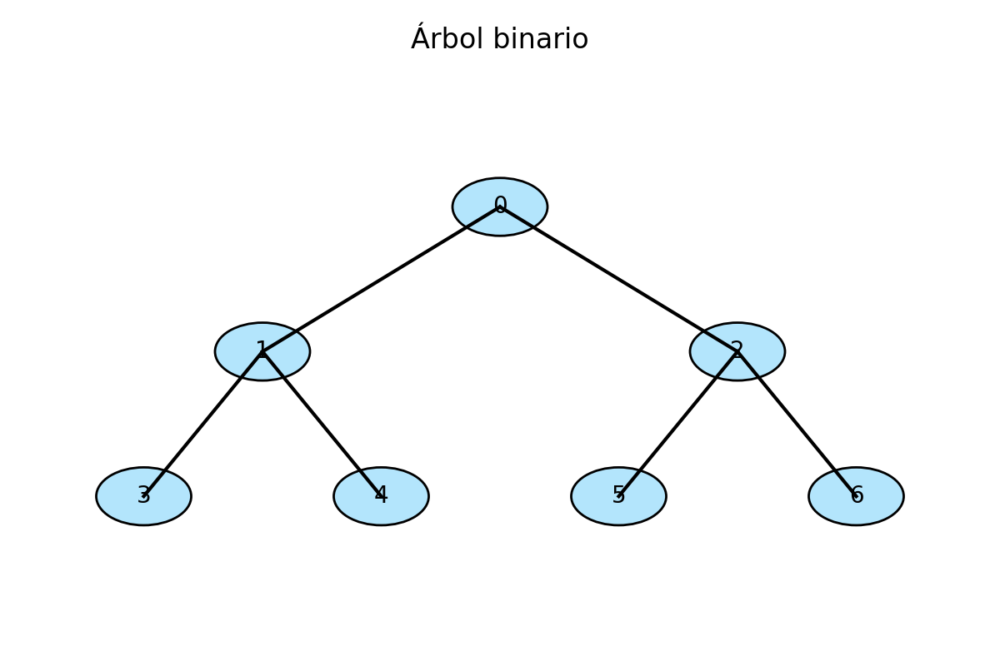

# Módulo 4 – Árboles y árboles binarios de búsqueda

## Introducción

Hasta ahora hemos trabajado con **estructuras lineales** (vectores, listas, pilas, colas).  
Para modelar relaciones jerárquicas, como un **sistema de archivos** o una **genealogía**, necesitamos estructuras en forma de **árbol**.  

Los árboles permiten:  
- Representar relaciones padre–hijo.  
- Organizar información de forma jerárquica.  
- Implementar búsquedas rápidas y estructuradas.  

En este módulo estudiaremos:  
1. El concepto de árbol y sus propiedades básicas.  
2. Los **árboles binarios** y sus variantes.  
3. Los **árboles binarios de búsqueda (BST)**.  
4. La importancia del equilibrio en los árboles.  

---

## 1. Conceptos básicos de árboles

Un **árbol** es una estructura jerárquica formada por nodos conectados mediante aristas.  

### Términos fundamentales

- **Raíz**: nodo sin padre.  
- **Hoja**: nodo sin hijos.  
- **Nodo interno**: tiene al menos un hijo.  
- **Profundidad**: número de aristas desde la raíz hasta un nodo.  
- **Altura del árbol**: máxima profundidad de sus nodos.  
- **Subárbol**: cualquier nodo junto con sus descendientes.  

⚡ Importante: en un árbol no hay ciclos, y entre dos nodos cualesquiera existe un único camino.

---

## 2. Árboles binarios

Un **árbol binario** es un árbol en el que cada nodo puede tener como máximo **dos hijos**: izquierdo y derecho.

### 2.1 Tipos de árboles binarios

- **Completo**: todos los niveles llenos salvo el último, que se completa de izquierda a derecha.  
- **Lleno**: cada nodo tiene 0 o 2 hijos.  
- **Perfecto**: completo y con todas las hojas al mismo nivel.  
- **Degenerado**: cada nodo tiene un único hijo → se comporta como una lista.  

### 2.2 Recorridos de árboles binarios

Los recorridos definen un orden para visitar los nodos:

1. **Preorden**: nodo → izquierdo → derecho.  
2. **Inorden**: izquierdo → nodo → derecho.  
3. **Postorden**: izquierdo → derecho → nodo.  

#### Pseudocódigo de recorrido inorden

```text
procedimiento inorden(nodo):
    si nodo = null entonces retornar
    inorden(nodo.izquierdo)
    procesar(nodo)
    inorden(nodo.derecho)
```

---

## 3. Árboles binarios de búsqueda (BST)

Un **BST** es un árbol binario donde:

* Todas las claves del subárbol izquierdo < clave del nodo.
* Todas las claves del subárbol derecho > clave del nodo.

Esto permite búsquedas, inserciones y eliminaciones en **O(h)**, siendo *h* la altura del árbol.
En árboles balanceados, $h = O(\log n)$.

### 3.1 Operaciones básicas

#### Búsqueda

```text
función buscar(nodo, clave):
    si nodo = null entonces devolver null
    si clave = nodo.clave entonces devolver nodo
    si clave < nodo.clave entonces devolver buscar(nodo.izquierdo, clave)
    si no devolver buscar(nodo.derecho, clave)
```

#### Inserción

```text
función insertar(nodo, clave):
    si nodo = null entonces devolver nuevoNodo(clave)
    si clave < nodo.clave entonces
        nodo.izquierdo ← insertar(nodo.izquierdo, clave)
    si clave > nodo.clave entonces
        nodo.derecho ← insertar(nodo.derecho, clave)
    devolver nodo
```

#### Eliminación (tres casos)

1. Nodo hoja → se elimina directamente.
2. Nodo con un hijo → se sustituye por su hijo.
3. Nodo con dos hijos → se reemplaza por su **sucesor inorden** (mínimo del subárbol derecho).

### 3.2 Ejemplo

Inserciones: 50, 30, 70, 20, 40, 60, 80.
Resultado: un árbol relativamente equilibrado con raíz 50.

---

## 4. Árboles equilibrados

El rendimiento de un BST depende de su altura.
Si el árbol se desequilibra, puede degenerar en una lista ($O(n)$).

Para evitarlo se usan árboles **auto-balanceados**:

* **AVL**: mantiene la diferencia de alturas ≤ 1 mediante rotaciones.
* **Rojo–negro**: garantizan equilibrio “relajado” con propiedades de color.

Ambos logran $O(\log n)$ en búsqueda, inserción y eliminación.

---

## 5. Aplicaciones de los árboles

* **Sistemas de archivos**: jerarquías de directorios.
* **Expresiones aritméticas**: árboles de expresión.
* **Bases de datos**: índices implementados con árboles B/B+.
* **Bioinformática**: árboles filogenéticos y jerarquías de clustering.

{ width=70% }

*Figura 7: árbol binario completo de tres niveles.*

---

## 6. Conclusiones

* Los árboles modelan relaciones jerárquicas.
* Los árboles binarios permiten recorridos sistemáticos.
* Los BST permiten búsquedas eficientes gracias a la propiedad de orden.
* El equilibrio es clave: sin él, la eficiencia puede degradarse drásticamente.

En el próximo módulo estudiaremos los **grafos**, estructuras más generales que permiten representar cualquier tipo de relación.

---

## 7. Ejercicios de autoevaluación

1. ¿Cuál es la diferencia entre un árbol binario completo y uno perfecto?
2. Explica la diferencia entre un recorrido inorden y preorden.
3. Dibuja el árbol resultante de insertar en orden: 10, 5, 20, 3, 7, 15, 30.
4. ¿Qué ocurre con el rendimiento de un BST si los datos se insertan en orden ascendente?
5. Implementa en pseudocódigo una función que calcule la altura de un árbol.
6. ¿Qué ventajas ofrecen los árboles AVL frente a los BST estándar?
7. Menciona una aplicación práctica de árboles en bioinformática.

---

## Referencias

* Cormen, T. H., Leiserson, C. E., Rivest, R. L., & Stein, C. *Introduction to Algorithms*. MIT Press.
* Weiss, M. A. *Data Structures and Algorithm Analysis*. Pearson.
* Goodrich, M. T., Tamassia, R., & Goldwasser, M. H. *Data Structures and Algorithms in Java*. Wiley.
* Sedgewick, R., & Wayne, K. *Algorithms*. Addison-Wesley.