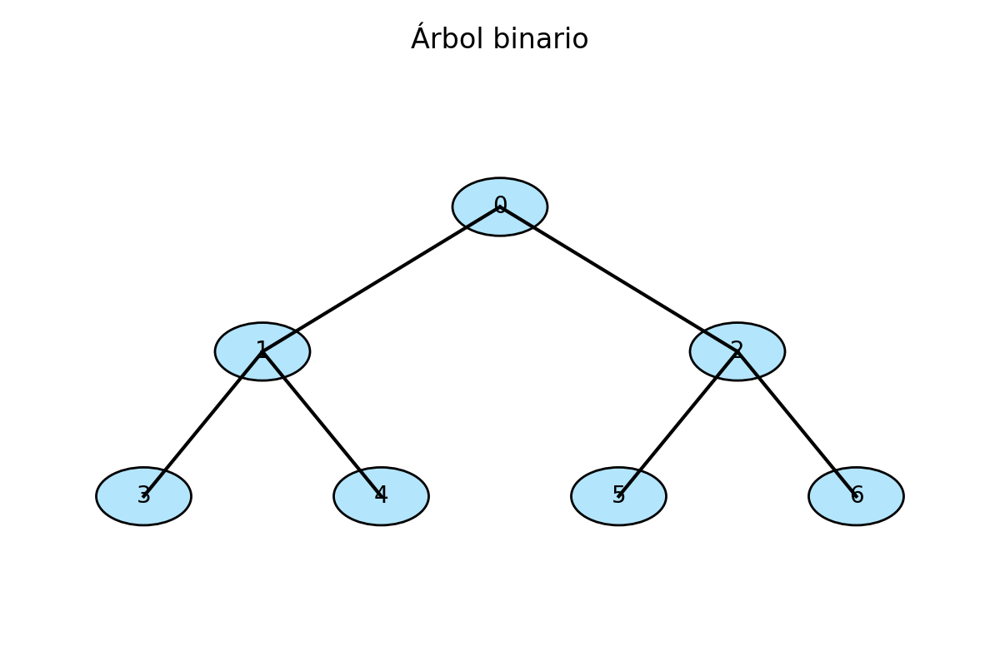

# Módulo 4 – Árboles y árboles binarios de búsqueda

## Introducción

Las estructuras vistas hasta ahora son lineales: los elementos se organizan uno detrás de otro.  Para modelar situaciones jerárquicas, como la organización de un archivo de directorios o la genealogía familiar, se utilizan **árboles**.  Los árboles permiten representar relaciones padre–hijo, realizar búsquedas jerárquicas y almacenar información de manera eficiente.  Este módulo introduce el concepto de árbol, los **árboles binarios** y una de sus variantes más importantes: el **árbol binario de búsqueda** (BST).

## 1. Conceptos básicos de árboles

Un **árbol** es una estructura jerárquica formada por nodos conectados mediante aristas.  Cada nodo puede tener cero o más hijos y, excepto el nodo raíz, cada nodo tiene exactamente un padre.  En un árbol no existen ciclos: para cualquier par de nodos solo hay un camino único que los conecta.  

Los términos fundamentales son:

* **Raíz**: el nodo superior sin padre.
* **Hoja**: un nodo sin hijos (también llamado *nodo externo*).  
* **Nodo interno**: nodo con al menos un hijo.
* **Profundidad**: número de aristas desde la raíz hasta el nodo.
* **Altura del árbol**: máxima profundidad de sus nodos.
* **Subárbol**: cualquier nodo con sus descendientes forma un subárbol.

## 2. Árboles binarios

Un **árbol binario** es un árbol en el que cada nodo puede tener como máximo dos hijos: uno izquierdo y uno derecho.  Si un nodo no tiene hijo izquierdo o derecho, se considera que en ese lugar hay un *nodo externo* (nulo).  Desde el punto de vista de la teoría de grafos, un árbol binario es un grafo conexo y acíclico en el que cada vértice tiene grado a lo sumo 2【334696741446499†L170-L178】【334696741446499†L187-L190】.

### Tipos de árboles binarios

* **Árbol binario completo**: todos los niveles, salvo posiblemente el último, están completamente llenos y los nodos del último nivel se ubican lo más a la izquierda posible.
* **Árbol binario lleno**: cada nodo tiene exactamente cero o dos hijos; todos los niveles están completamente llenos.
* **Árbol binario perfecto**: es completo y lleno; todos los nodos hoja están al mismo nivel.
* **Árbol binario degenerado**: cada nodo tiene un único hijo; se comporta como una lista enlazada.

### Recorridos de árboles binarios

Para procesar o listar los elementos de un árbol se utilizan recorridos.  Los tres recorridos profundos clásicos son:

1. **Preorden**: se procesa el nodo actual, luego el subárbol izquierdo y finalmente el subárbol derecho.
2. **Inorden**: se procesa el subárbol izquierdo, luego el nodo actual y finalmente el subárbol derecho.
3. **Postorden**: se procesa el subárbol izquierdo, luego el subárbol derecho y finalmente el nodo actual.

Estos recorridos se implementan de forma recursiva.  Por ejemplo, el recorrido inorden para un nodo `nodo` se define como:

```text
inorden(nodo):
    si nodo es nulo entonces retornar
    inorden(nodo.izquierdo)
    procesar(nodo)
    inorden(nodo.derecho)
```

## 3. Árboles binarios de búsqueda (BST)

Un **árbol binario de búsqueda** es un árbol binario en el que para cada nodo se cumple que las claves del subárbol izquierdo son menores que la clave del nodo y las claves del subárbol derecho son mayores【816587823773105†L79-L82】.  Esta propiedad permite que las operaciones de búsqueda, inserción y eliminación tengan complejidad \(O(h)\), donde \(h\) es la altura del árbol.  En un árbol equilibrado \(h\) está en \(O(\log n)\), pero en el peor de los casos (árbol degenerado) puede ser \(O(n)\).

### Operaciones sobre un BST

Las operaciones básicas sobre un árbol binario de búsqueda son【816587823773105†L90-L103】:

* **Búsqueda**: se compara la clave buscada con la del nodo actual.  Si es menor, se busca en el subárbol izquierdo; si es mayor, en el subárbol derecho; si es igual, se ha encontrado el nodo.  
* **Inserción**: se busca la posición donde debería estar la nueva clave siguiendo la misma regla que en la búsqueda y se inserta un nuevo nodo en esa posición.
* **Eliminación**: existen tres casos: (1) el nodo es una hoja, en cuyo caso se elimina sin más; (2) el nodo tiene un solo hijo, se sustituye por su hijo; (3) el nodo tiene dos hijos, se reemplaza por su sucesor inorden (el mínimo del subárbol derecho) y se elimina este sucesor.
* **Altura**: se puede calcular recursivamente tomando la máxima altura de los subárboles izquierdo y derecho más uno.
* **Número de nodos**: recursivamente, el número de nodos es la suma de los nodos de los subárboles izquierdo y derecho más uno.

### Ejemplo de inserción en un BST

Considere el siguiente orden de inserciones: \(50, 30, 70, 20, 40, 60, 80\).  Inicialmente el árbol está vacío; el primer elemento (50) se convierte en la raíz.  El 30 es menor que 50, por lo que se inserta como hijo izquierdo.  El 70 es mayor que 50, se inserta como hijo derecho.  El 20 es menor que 50 y 30, por lo que se coloca a la izquierda de 30, y así sucesivamente.  El resultado es un árbol binario de búsqueda equilibrado.

## 4. Árboles equilibrados

El rendimiento de un BST depende de su altura.  Un árbol desequilibrado puede degradarse en una lista enlazada y perder su ventaja.  Existen variantes de BST que se mantienen equilibradas mediante rotaciones, como los **árboles AVL** y los **árboles rojos-negros**.  Estos árboles garantizan que la altura crece logarítmicamente con el número de nodos, permitiendo búsquedas e inserciones en \(O(\log n)\).  Si bien se estudiarán en profundidad en cursos avanzados, conviene conocer su existencia.

### Ilustración de un árbol binario

La figura 7 muestra un árbol binario completo de tres niveles.  Cada nodo tiene hasta dos hijos y las aristas representan las relaciones padre–hijo.

{ width=70% }

*Figura 7: representación gráfica de un árbol binario.*

## 5. Conclusiones

Los árboles son estructuras jerárquicas que permiten modelar relaciones padre–hijo y facilitan la búsqueda organizada de información.  Los árboles binarios restringen el número de hijos a dos y dan lugar a algoritmos de recorrido sistemáticos (preorden, inorden, postorden).  Los árboles binarios de búsqueda aprovechan la propiedad de orden para realizar búsquedas e inserciones eficientes; no obstante, su rendimiento depende de la altura del árbol.  En el siguiente módulo se estudiarán los **grafos** y los algoritmos de recorrido más generales.

## Referencias

1.  Definición formal de árbol binario y su relación con la teoría de grafos【334696741446499†L170-L178】【334696741446499†L187-L190】.
2.  Propiedad de los árboles binarios de búsqueda: las claves del subárbol izquierdo son menores y las del derecho mayores【816587823773105†L79-L82】.
3.  Operaciones básicas sobre un BST: búsqueda, inserción, eliminación, cálculo de altura y número de nodos【816587823773105†L90-L103】.