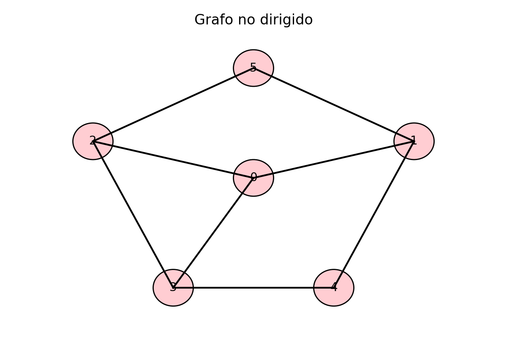

# Módulo 5 – Grafos y algoritmos de recorrido

## Introducción

Los **grafos** son estructuras de datos muy versátiles que permiten modelar relaciones entre objetos.  A diferencia de los árboles, los grafos pueden contener ciclos y no necesariamente tienen una organización jerárquica.  Se utilizan para representar redes de transporte, conexiones de ordenadores, relaciones sociales y muchas otras estructuras complejas.  En este módulo se introduce la teoría básica de grafos y se estudian dos algoritmos fundamentales de recorrido: **breadth‑first search** (BFS) y **depth‑first search** (DFS).

## 1. Conceptos fundamentales

Un **grafo** \(G = (V,E)\) está formado por un conjunto de **vértices** \(V\) y un conjunto de **aristas** \(E\), donde cada arista conecta dos vértices.  Según la naturaleza de las aristas y de los vértices, se clasifican los grafos en:

* **No dirigidos**: las aristas no tienen orientación; la conexión entre dos vértices es bidireccional.  Se representa con un par no ordenado \(\{u,v\}\).
* **Dirigidos (dígrafos)**: cada arista tiene un sentido; se representa con un par ordenado \((u,v)\) y solo se puede recorrer de \(u\) a \(v\).
* **Ponderados**: se asigna un peso o coste a cada arista (distancia, coste, tiempo, etc.).

### Representaciones de grafos

* **Matriz de adyacencia**: es una matriz cuadrada \(|V|\times |V|\) en la que la entrada \(a_{ij}\) vale 1 (o el peso correspondiente) si existe una arista de \(i\) a \(j\); en caso contrario, vale 0.  Es adecuada para grafos densos pero consume mucho espacio para grafos dispersos.
* **Lista de adyacencia**: cada vértice tiene una lista con sus vecinos adyacentes.  Esta representación es eficiente en espacio para grafos dispersos y permite recorrer fácilmente los vecinos de un vértice.

### Ilustración de un grafo

La figura 8 muestra un grafo no dirigido de seis vértices.  Las aristas unen pares de vértices y el grafo puede tener ciclos.

{ width=75% }

*Figura 8: ejemplo de grafo no dirigido.*

## 2. Recorrido en anchura (BFS)

El **algoritmo de búsqueda en anchura** (BFS) recorre un grafo visitando primero los vértices más cercanos al origen.  Dado un vértice inicial, BFS explora todos sus vecinos inmediatos antes de avanzar a los vecinos de estos.  En otras palabras, BFS visita los vértices **nivel por nivel**: primero todos los de distancia 1, luego los de distancia 2, y así sucesivamente.  Para lograrlo utiliza una **cola** para almacenar los vértices pendientes de explorar【360779338937104†L142-L151】.  BFS es la base de algoritmos como el de Dijkstra para calcular caminos mínimos.

### Pseudocódigo de BFS

```
BFS(Grafo G, vértice origen):
    crear una cola Q
    marcar origen como visitado y encolarlo en Q
    mientras Q no esté vacía:
        v ← desencolar Q
        procesar v
        para cada vecino u de v en la lista de adyacencia:
            si u no está marcado como visitado:
                marcar u como visitado
                encolarlo en Q
```

El algoritmo visita cada vértice y cada arista a lo sumo una vez, por lo que su complejidad temporal es \(O(|V| + |E|)\) y la complejidad espacial es \(O(|V|)\), correspondientes a la cola y a la marca de vértices visitados.

### Aplicaciones de BFS

* **Cálculo de distancias mínimas** en grafos no ponderados (todos los pesos iguales).
* **Comprobación de conectividad**: determinar si todos los vértices son alcanzables desde un vértice dado.
* **Construcción de árboles generadores**: BFS genera un árbol de expansión que contiene los caminos más cortos desde el origen.

## 3. Recorrido en profundidad (DFS)

El **algoritmo de búsqueda en profundidad** (DFS) explora un grafo adentrándose lo máximo posible en cada rama antes de retroceder.  Parte de un vértice inicial y sigue una arista hasta llegar a un vértice sin vecinos no visitados; entonces retrocede por el camino hasta encontrar un vértice con vecinos no explorados y repite el proceso.  Este comportamiento implica utilizar una **pila** para recordar los vértices que permiten retroceder.  DFS visita cada vértice una sola vez y se implementa de manera recursiva o iterativa【930398398182482†L192-L198】.

### Pseudocódigo de DFS (versión recursiva)

```
DFS(Grafo G, vértice v):
    marcar v como visitado
    procesar v
    para cada vecino u de v en la lista de adyacencia:
        si u no está marcado como visitado:
            DFS(G, u)
```

Al igual que BFS, DFS tiene complejidad temporal \(O(|V| + |E|)\) y complejidad espacial \(O(|V|)\) cuando se usa una pila para almacenar los vértices en la rama actual【930398398182482†L203-L214】.

### Aplicaciones de DFS

* **Detección de ciclos** en grafos dirigidos y no dirigidos.
* **Clasificación topológica** en grafos dirigidos acíclicos (DAG), ordenando sus vértices de modo que todas las aristas vayan de izquierda a derecha.
* **Exploración de laberintos y juegos**: DFS permite recorrer exhaustivamente espacios de estado.

## 4. Comparación entre BFS y DFS

| Algoritmo | Estrategia | Estructura auxiliar | Camino encontrado |
|-----------|-----------|---------------------|------------------|
| **BFS** | Explora por niveles desde el origen. | Cola (FIFO). | Encuentra el camino más corto en grafos no ponderados. |
| **DFS** | Explora lo más profundo posible antes de retroceder. | Pila (LIFO) o recursión. | No garantiza el camino más corto; útil para explorar todo el grafo. |

La elección de BFS o DFS depende del problema.  BFS es preferible cuando se buscan caminos mínimos o niveles en grafos no ponderados.  DFS es útil para explorar exhaustivamente y para problemas que requieren retroceso (*backtracking*).

## 5. Conclusiones

Los grafos constituyen una herramienta fundamental para representar relaciones complejas.  Las estrategias de recorrido BFS y DFS permiten visitar sus vértices de manera sistemática.  BFS explora el grafo por niveles utilizando una cola y encuentra rutas más cortas en grafos sin pesos; DFS explora en profundidad utilizando una pila o recursión y resulta útil para detección de ciclos y búsqueda exhaustiva.  En el siguiente módulo se estudiarán algoritmos de **búsqueda y ordenación** para gestionar datos de forma eficiente.

## Referencias

1.  Explicación del algoritmo BFS: recorre el grafo nivel por nivel y utiliza una cola para almacenar vértices pendientes【360779338937104†L142-L151】.
2.  Definición de DFS como algoritmo que explora ramas hasta donde sea posible y necesita una pila para retroceder【930398398182482†L192-L198】.
3.  Complejidad temporal y espacial de DFS en función del número de vértices y aristas【930398398182482†L203-L214】.